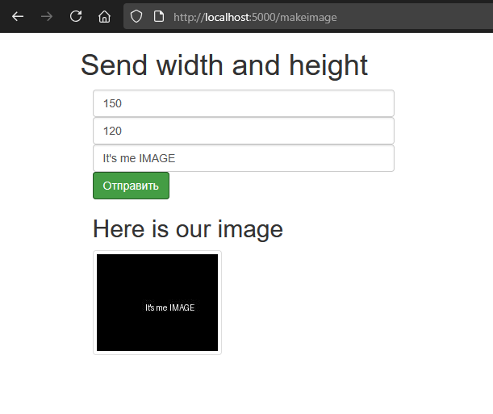

## Лабораторная работа №10

### Отчёт
Выполнил студент гр.1, п.гр.1, Сибилев Антон Игоревич

Приложение разработано на фреймворке Flask. По маршруту /makeimage получает значения width,  height (выраженные в пикселах) и текст в виде параметров POST-запроса из HTML формы страницы на сервере Flask (т.е. например width=100, height=200 и text=Hello) и возвращает изображение (в виде массива байтов) в формате JPG (image/jpg) с этими размерами, и отображается на той же HTML странице.

Усложнения:
* Реализация фронтэнда и отправка данных на сервер с использованием какого-либо фронтэнд-фреймворка Jinja.
* Вывод и отображение самого изображения на страницу с формой (без перезагрузки страницы, асинхронно) или другую страницу как thumbnail.
* Для формы данных изображения используется модель UploadForm().

