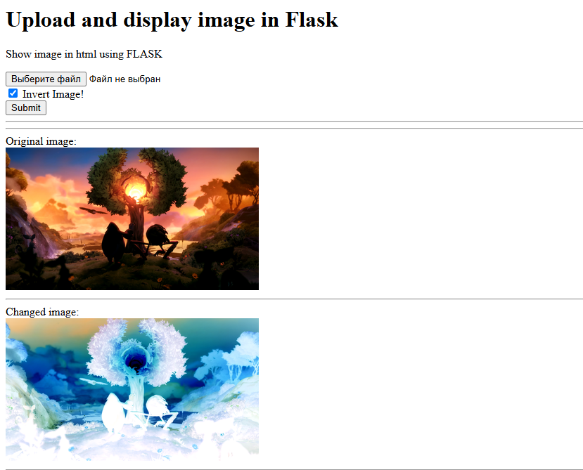

## Лабораторная работа #10
### Тема Yandex Serverless

### Задача
Развернуть Yandex Serverless приложение для преобразования картинок и их отображения EXIF-данных

## Отчёт

Выполнил студент гр.1, п.гр.1, Сибилев Антон Игоревич

### Структура проекта
```bach
project/
├── main.py                # Основной файл приложения Flask
├── requirements.txt       # Зависимости
├── Dockerfile             # Инструкция сборки образа
└── templates/
    ├── index.html
    └── image-convert.html
```

### Сборка docker-контейнера
Dockerfile
```dockerfile
FROM python:3.12-alpine

COPY ./requirements.txt /app/requirements.txt

WORKDIR /app

RUN pip install --upgrade pip && \
    pip install -r requirements.txt

COPY . /app

EXPOSE 5000

CMD [ "python", "main.py" ]
```

Авторизация для доступа к реестру
```bash
docker login --username oauth --passwor-stdin <OAuth-токен> cr.yandex
```
<OAuth-токен> - токен для доступа

Сборка Docker-образа локально
```bash
docker build . -t cr.yandex/<registry-id>/flask-image-invertor-application:v0.0.2
```
<registry-id> - id реестра yandex.console.

Публикация образа в реестре
```bash
docker push cr.yandex/<registry-id>/flask-image-invertor-application:v0.0.2
```

После публикации образа был создан и настроен контейнер:
* Установлен опубликованный образ
* Выбран/создан аккаунт с базовой ролью container-registry.images.puller.

После успешного запуска приложения, оно доступно по адресу https://crprm94t2tmhgqqcd9ja.web.yandexcloud.net



### Вывод
Проект успешно развёрнут в виде Docker-контейнера на Yandex.Cloud и предоставляет удобный веб-интерфейс для работы с изображениями и метаданными.
