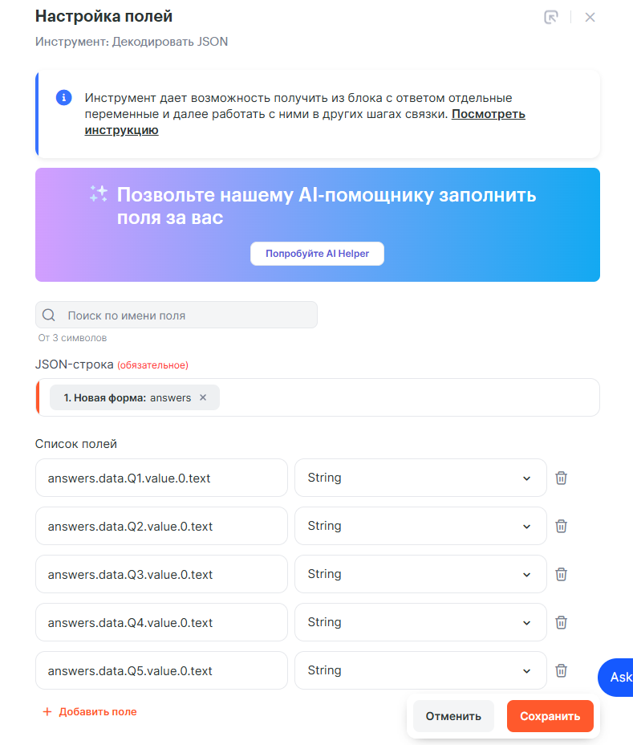
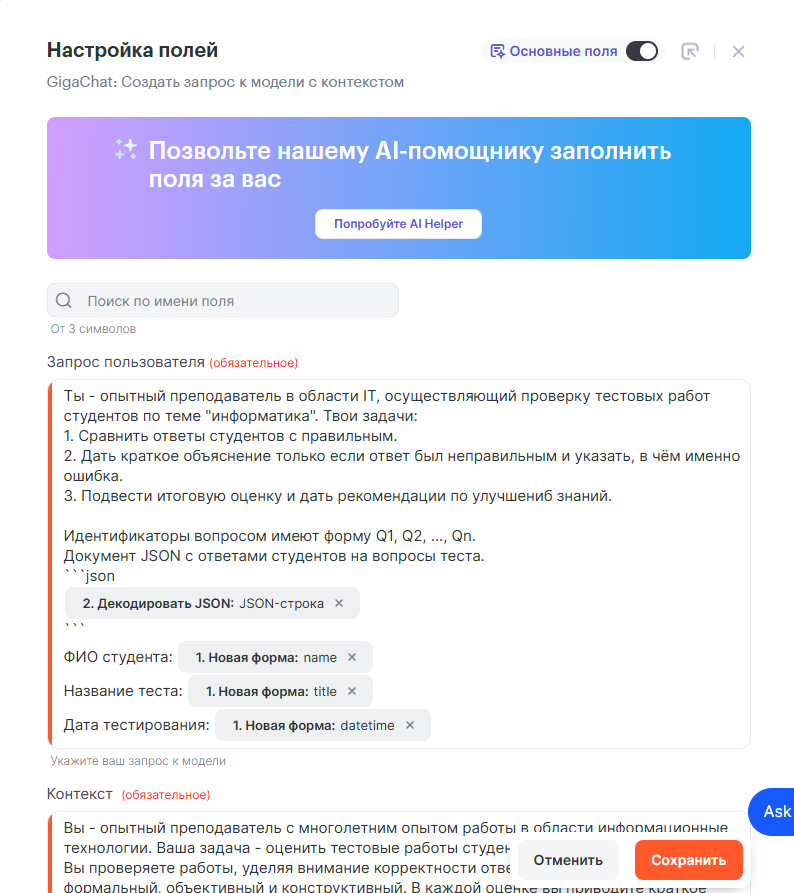
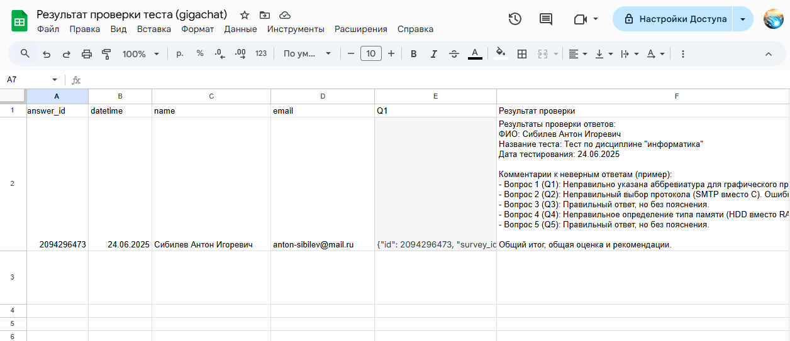
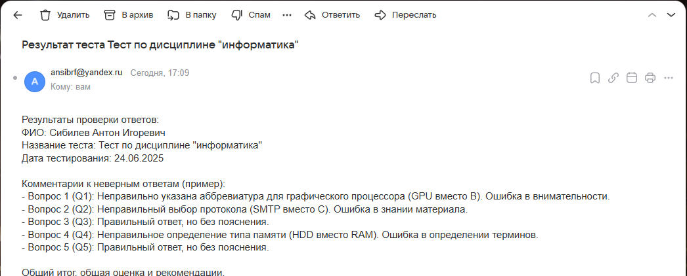
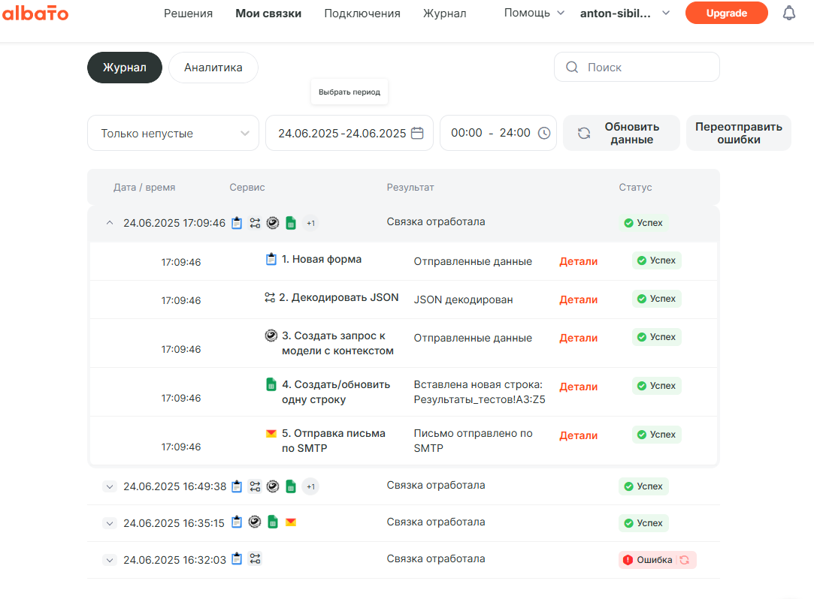

## Лабораторная работа №13
### Тема Автоматизация тестирования с помощью GigaChat и Yandex.Forms

### Постановка задачи
Используйте сервисы
* Yandex Forms
* Albato
* GigaChat API
* Yandex Почта
* Google Sheets
* Организуйте автоматизированную проверку теста, созданного в Yandex Forms.

Бизнес процесс:
1. Отправка ответа из Yandex Forms в связку Albato.
2. Извлечение ФИО и email ученика из JSON.
3. Извлечение ответов ученика из JSON.
4. Формирование и отправка сообщения в GigaChat через GigaChat API.
5. Получение ответа от GigaChat.
6. Запись ответов ученика и комментария "преподавателя" (нейросети) в таблицу Google Sheets.
7. Отправка ответа нейросети ученику на почту.

Создайте в Albato настроенную связку из перечисленных в указанном порядке сервисов и инструментов работы с данными (в частности с JSON).

## Отчёт

Выполнил студент гр.1, п.гр.1, Сибилев Антон Игоревич

### Структура связки в Albato

Связка состоит из 5 этапов (модулей)

#### 0. Настройка Яндекс Форм

#### 1. Триггер: Получение данных из Яндекс Форм

Источник: Вебхук из Яндекс Форм (через Albato Webhook).

Тип данных: JSON-объект с полями:
* name: имя участника
* email: адрес электронной почты
* answers: JSON с ответами на тест
* datetime: дата и время отправки формы
* title: название теста
* answer_id: идентификатор теста

#### 2. Обработчик: Извлечение данных из JSON

Встроенный JSON парсер Albato.

Извлекает из answers ответы ученика (Q1, Q2, ...), чтобы передать ответы в следующий модуль.

Результат: Структурированные ответы по каждому вопросу.

#### 3. Формирование сообщения в GigaChat

Запрос к GigaChat API.
В запросе используется контекст для формирования сообщения.
Передаваемые данные:
Имя участника
Название теста
Ответы по каждому вопросу

GigaChat производит анализ ответов и составляет рекомендаций по итогу прохождения теста.

#### 4. Google Sheets: Сохранение результатов

Интеграция Albato с Google Sheets.

Действие: Добавить новую строку в таблицу с полями:
* Имя участника
* Email
* Название теста
* Дата и время отправки
* Ответы (в сыром виде)
* Ответ от Gigachat

#### 5. Email: Отправка письма участнику

Интеграция с почтовым сервисом (например, Gmail или SMTP).

Используемые данные:
Получатель: email участника
Тема письма: Результаты "<название теста>"
Тело письма: Ответ Gigachat

### Результат

Полностью автоматизированная цепочка обработки результатов теста:
* без ручного вмешательства;
* с интеллектуальной проверкой;
* хранением данных;
* обратной связью для пользователя.

Ссылка на форму: https://forms.yandex.ru/u/685a8306eb6146cceb0eb848

Сохранение результатов в Google Sheets:

Отправка письма участнику:

Работа модулей:

