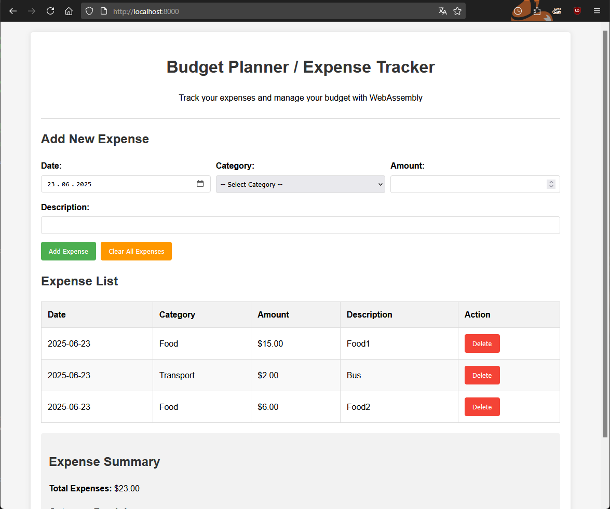

## Лабораторная работа №5.
### Тема: WebAssembly.

Выполнил: студент гр.1, п.гр.1 Сибилев Антон Игоревич

### Установка компилятора Emscripten

Для сборки проекта был установлен компилятор Emscripten, выполнены следующие шаги:

Установлена система Emscripten SDK согласно инструкции:

```bash
git clone https://github.com/emscripten-core/emsdk.git
cd emsdk
./emsdk install latest
./emsdk activate latest
source ./emsdk_env.sh
```

Проверена корректность установки командой

```bash
emcc -v
```

### Сборка и запуск проекта

Компиляция
Был использован следующий командный шаблон для сборки C-кода в WebAssembly:

```bash
emcc main.c -o index.js -s WASM=1 -O2 \
-s EXPORTED_RUNTIME_METHODS='["stringToUTF8","UTF8ToString"]' \
-s EXPORTED_FUNCTIONS='["_main","_jsAddExpense","_jsDeleteExpense","_jsClearAllExpenses","_jsGetTotalExpenses","_jsGetExpenseCount","_jsGetCategoryCount","_getExpenseJSON","_getCategoryTotalJSON","_freeMemory","_malloc","_free"]' \
--shell-file index.html -s ALLOW_MEMORY_GROWTH=1
```

После успешной компиляции были созданы следующие файлы:
* index.js (JavaScript-обёртка)
* index.wasm (модуль WebAssembly)

### Запуск
Проект был запущен локально с использованием Python:
```bash
python3 -m http.server 8000
```



### Улучшение: Среднее значение расходов за год

Одним из логичных расширений функциональности является добавление вычисления среднего значения расходов за год. Это позволяет пользователю получить более наглядное представление о среднем уровне своих трат.

Была начата разработка нужного функционала в файле main.c:

```c
#define MAX_CATEGORY_NAME 64

typedef struct Expense {
    int year;
    char category[MAX_CATEGORY_NAME];
    double amount;
    struct Expense* next;
} Expense;

typedef struct CategoryTotalYearly {
    int year;
    char category[MAX_CATEGORY_NAME];
    double total;
    struct CategoryTotalYearly* next;
} CategoryTotalYearly;

static Expense* expenses_head = NULL;
static CategoryTotalYearly* totals_head = NULL;


// Add an expense to the linked list
void add_expense(const char* date, const char* category, double amount, const char* description) {
    int year = parse_year(date);

    Expense* new_expense = (Expense*)malloc(sizeof(Expense));
    if (!new_expense) {
        perror("Failed to allocate memory");
        exit(EXIT_FAILURE);
    }
    new_expense->year = year;
    strncpy(new_expense->category, category, MAX_CATEGORY_NAME - 1);
    new_expense->category[MAX_CATEGORY_NAME - 1] = '\0';
    new_expense->amount = amount;
    new_expense->next = expenses_head;
    expenses_head = new_expense;
}

// Helper: Find or create a CategoryTotalYearly entry
CategoryTotalYearly* find_or_create_total(int year, const char* category) {
    CategoryTotalYearly* curr = totals_head;
    while (curr) {
        if (curr->year == year && strcmp(curr->category, category) == 0) {
            return curr;
        }
        curr = curr->next;
    }

    // Not found, create new
    CategoryTotalYearly* new_total = (CategoryTotalYearly*)malloc(sizeof(CategoryTotalYearly));
    if (!new_total) {
        perror("Failed to allocate memory");
        exit(EXIT_FAILURE);
    }
    new_total->year = year;
    strncpy(new_total->category, category, MAX_CATEGORY_NAME - 1);
    new_total->category[MAX_CATEGORY_NAME - 1] = '\0';
    new_total->total = 0.0;
    new_total->next = totals_head;
    totals_head = new_total;
    return new_total;
}

// Calculate totals per category per year
void calculate_expense_totals() {
    CategoryTotalYearly* temp;
    // Clear previous totals
    while (totals_head) {
        temp = totals_head;
        totals_head = totals_head->next;
        free(temp);
    }

    for (Expense* e = expenses_head; e != NULL; e = e->next) {
        CategoryTotalYearly* total_entry = find_or_create_total(e->year, e->category);
        total_entry->total += e->amount;
    }
}


// Cleanup memory
void free_all_expenses() {
    Expense* temp;
    while (expenses_head) {
        temp = expenses_head;
        expenses_head = expenses_head->next;
        free(temp);
    }
    CategoryTotalYearly* ttemp;
    while (totals_head) {
        ttemp = totals_head;
        totals_head = totals_head->next;
        free(ttemp);
    }
}
```

Однако из-за сложности интеграции функционала языка C в JavaScript проект не был завершен.
